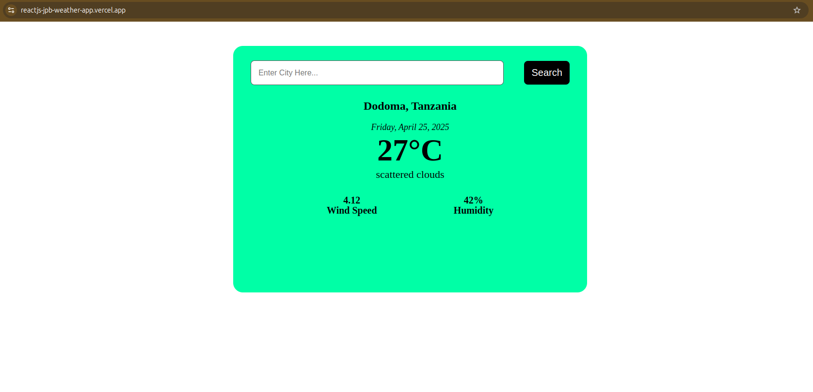

# 🌦️ React Weather App

This is a clean **Weather App** built with **React JS** And **Vite** which fetches real-time weather data using the **OpenWeather API**. Users can search for any city around the world and get details such as temperature, weather description, humidity, and wind speed.

> 💡 Project built as part of my React learning journey - Day 24.

---

## 🚀 Live Demo

👉 [Click here to view the live app](https://reactjs-jpb-weather-app.vercel.app)

---

## 🛠️ Tech Stack

- **React JS**
- **JavaScript (ES6+)**
- **OpenWeatherMap API**
- **Vite**
- **CSS**
- **Vercel** for deployment

---

## 📸 Screenshots



---

## ✨ Features

- 🔍 Search weather by city name
- 🌡️ Real-time temperature (converted from Kelvin to Celsius)
- 🌬️ Wind speed and 💧 humidity information
- 📍 Default location (Dodoma) loaded on first visit
- 🧊 Simple and responsive UI
- ⚙️ Handles loading and error states gracefully

---

## 📦 Installation

To run this project locally:

```bash
git clone https://github.com/your-username/react-weather-app.git
cd react-weather-app
npm install
npm run dev
